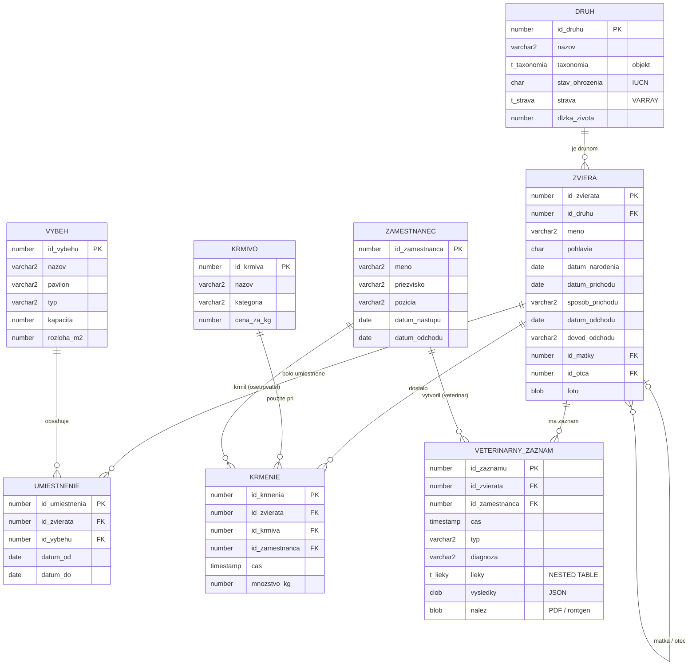

# ZOO – informačný systém zoologickej záhrady

Semestrálna práca z predmetu PDS (zadanie: [`zadanie/zadanie_semestralnej_prace_2026.pdf`](zadanie/zadanie_semestralnej_prace_2026.pdf)).

## Téma

Informačný systém pre zoologickú záhradu, ktorý eviduje:

- **druhy** zvierat s vedeckým zaradením a stavom ohrozenia (IUCN),
- **zvieratá** – jednotlivých jedincov, ich príchod / odchod, fotky a **rodokmeň** (matka, otec),
- **výbehy** a **históriu umiestnenia** zvierat vo výbehoch (od – do),
- **zamestnancov** – ošetrovateľov a veterinárov,
- **kŕmenie** – kto, čo, koľko a kedy zviera dostalo,
- **veterinárne záznamy** – prehliadky, očkovania, liečby a zákroky s liekmi, nameranými hodnotami a prílohami.

## Dátový model

8 tabuliek, 4 používateľské typy. Definície sú v [`sql/01_typy.sql`](sql/01_typy.sql)
a [`sql/02_tabulky.sql`](sql/02_tabulky.sql).



### Tabuľky

| Tabuľka | Popis |
|---|---|
| `druh` | živočíšny druh – slovenský názov, taxonómia (objekt), stav ohrozenia, strava (VARRAY), dĺžka života |
| `zviera` | jedinec – meno, pohlavie, narodenie, príchod (narodenie / presun / záchrana), odchod (úhyn / presun / vypustenie), matka a otec, fotka (BLOB) |
| `vybeh` | výbeh alebo expozícia – pavilón, typ (vonkajší, voliéra, akvárium, …), kapacita, rozloha |
| `umiestnenie` | história: zviera bolo vo výbehu v intervale `<datum_od, datum_do)`, `datum_do = NULL` znamená teraz |
| `zamestnanec` | ošetrovateľ alebo veterinár, nástup / odchod |
| `krmivo` | druh krmiva, kategória, cena za kg |
| `krmenie` | každé kŕmenie: zviera, krmivo, ošetrovateľ, čas, množstvo – **najobjemnejšia tabuľka (100 000+)** |
| `veterinarny_zaznam` | typ záznamu, diagnóza, lieky (NESTED TABLE), výsledky v JSON, príloha (BLOB) |

### Používateľské typy

| Typ | Druh | Použitie |
|---|---|---|
| `t_taxonomia` | OBJECT | `druh.taxonomia` – trieda, rad, čeľaď, rod, druh |
| `t_strava` | VARRAY(10) OF VARCHAR2 | `druh.strava` – zloženie potravy |
| `t_liek` | OBJECT | jeden liek – názov, dávka, jednotka, počet dní |
| `t_lieky` | TABLE OF `t_liek` | `veterinarny_zaznam.lieky` |

**`t_taxonomia`** spĺňa požiadavku na objektový atribút:

- **konštruktor** `t_taxonomia(trieda, rad, celad, vedecky_nazov)` – rozdelí vedecký názov
  (`'Panthera tigris altaica'`) na rod a druh, zjednotí veľké / malé písmená, overí platnosť,
- **funkcie** `vedecky_nazov()` → `Panthera tigris altaica`, `skrateny_nazov()` → `P. tigris altaica`,
  `pribuznost(iny)` → úroveň spoločného zaradenia (0 = iná trieda … 4 = rovnaký rod, 5 = rovnaký druh),
- **metóda na triedenie** `MAP MEMBER FUNCTION triedenie` – zoradenie podľa systematiky
  (`ORDER BY d.taxonomia`).

```sql
SELECT d.nazov, d.taxonomia.vedecky_nazov(), d.taxonomia.pribuznost(t.taxonomia)
FROM druh d, druh t
WHERE t.nazov = 'Tiger ussurijský'
ORDER BY d.taxonomia;
```

## Pokrytie zadania

| Požiadavka zo zadania | Riešenie |
|---|---|
| PL/SQL | metódy objektových typov; generátor dát a výstupy budú v PL/SQL balíkoch |
| Veľké binárne objekty | `zviera.foto` (fotka), `veterinarny_zaznam.nalez` (PDF / röntgen), `veterinarny_zaznam.vysledky` (JSON) |
| Record, kolekcie, objekty | `t_taxonomia`, `t_liek` (objekty), `t_strava` (VARRAY), `t_lieky` (NESTED TABLE); v PL/SQL záznamy a kolekcie |
| Objektový atribút (2 funkcie, konštruktor, triedenie) | `druh.taxonomia` typu `t_taxonomia` |
| Časové atribúty | narodenie, príchod, odchod, umiestnenie od–do, čas kŕmenia, veterinárne záznamy, nástup / odchod zamestnanca |
| XML / JSON report | JSON výsledky vyšetrení; JSON / XML export karty zvieraťa |
| Správa súborov v DB | fotky zvierat, veterinárne nálezy |
| Analýza výkonnosti nad ≥ 100 000 záznamami | `krmenie` (denné kŕmenie všetkých zvierat za niekoľko rokov) |
| Dáta na vzdialenom serveri | stav ohrozenia druhu cez REST API (IUCN Red List / GBIF) alebo DB link na inú schému |

## Inštalácia

Požiadavky: Oracle Database 19c alebo novšia (overené na Oracle 23ai Free).

```sql
-- v adresári sql/ (SQL*Plus, SQLcl alebo SQL Developer – Run Script F5)
@install.sql
```

Skript zmaže existujúce objekty (`00_drop.sql`), vytvorí typy (`01_typy.sql`) a tabuľky (`02_tabulky.sql`).
Dá sa spúšťať opakovane.

## Štruktúra repozitára

```
zadanie/              zadanie semestrálnej práce (PDF)
sql/
  00_drop.sql         zmazanie objektov
  01_typy.sql         objektové typy a kolekcie
  02_tabulky.sql      tabuľky, obmedzenia, indexy, komentáre
  install.sql         inštalácia celej schémy
```

## Ďalšie kroky

1. generátor testovacích dát (PL/SQL),
2. špecifikácia a implementácia min. 12 výstupov,
3. prístup k vzdialeným dátam, analýza indexov, grafické rozhranie (APEX).
