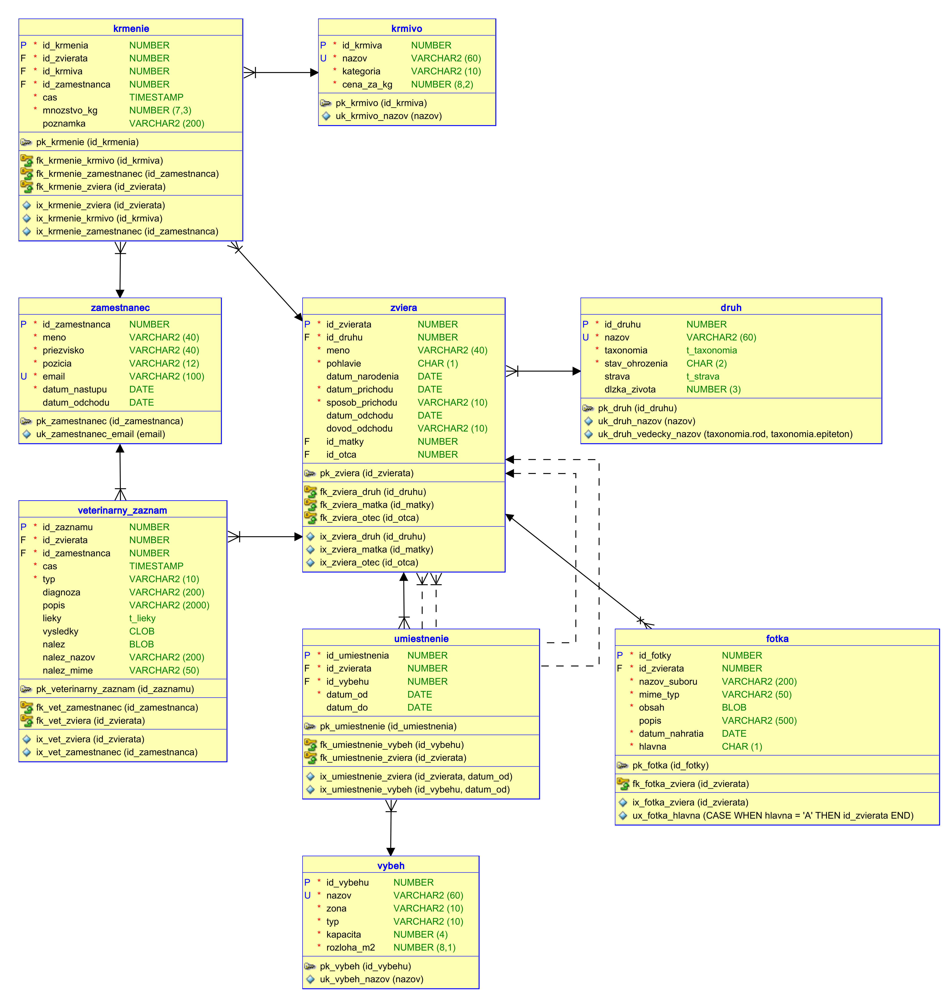
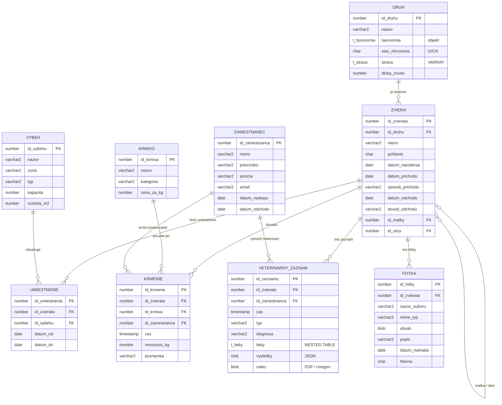

# ZOO – informačný systém zoologickej záhrady

Semestrálna práca z predmetu PDS (zadanie: [`zadanie/zadanie_semestralnej_prace_2026.pdf`](zadanie/zadanie_semestralnej_prace_2026.pdf)).

## Téma

Informačný systém pre zoologickú záhradu, ktorý eviduje:

- **druhy** zvierat s vedeckým zaradením a stavom ohrozenia (IUCN),
- **zvieratá** – jednotlivých jedincov, ich príchod / odchod a **rodokmeň** (matka, otec),
- **fotky** zvierat uložené priamo v databáze,
- **výbehy** v zónach areálu a **históriu umiestnenia** zvierat vo výbehoch (od – do),
- **zamestnancov** – ošetrovateľov a veterinárov,
- **kŕmenie** – kto, čo, koľko a kedy zviera dostalo,
- **veterinárne záznamy** – prehliadky, očkovania, liečby a zákroky s liekmi, nameranými hodnotami a prílohami.

## Dátový model

9 tabuliek – 6 hlavných (`druh`, `zviera`, `umiestnenie`, `krmenie`, `veterinarny_zaznam`, `fotka`)
a 3 menšie (`vybeh`, `zamestnanec`, `krmivo`) – a 4 používateľské typy. Definície sú v
[`sql/01_typy.sql`](sql/01_typy.sql) a [`sql/02_tabulky.sql`](sql/02_tabulky.sql).

Primárne kľúče sa plnia zo sekvencií (`seq_<tabuľka>`, použité ako `DEFAULT` stĺpca).
Všetky časové intervaly sú polootvorené `<od, do)`: deň „do“ do intervalu už nepatrí
a `NULL` v „do“ znamená, že interval stále trvá.

Evidujú sa len druhy chované a sledované po jedincoch (cicavce, vtáky, plazy, väčšie ryby);
hejná drobných rýb a hmyz sa neevidujú.

### Relačný model (SQL Developer Data Modeler)

Návrh je v [`model/zoo.dmd`](model/zoo.dmd) (otvára sa v Data Modeleri cez File → Open),
diagram na tlač v [`model/zoo_relacny_model.pdf`](model/zoo_relacny_model.pdf).
Vznikol importom DDL zo `sql/` (File → Import → DDL File, Oracle Database 21c).



### Prehľad vzťahov



### Tabuľky

| Tabuľka | Popis |
|---|---|
| `druh` | živočíšny druh – slovenský názov, taxonómia (objekt), stav ohrozenia, strava (VARRAY kódov kategórií krmiva), dĺžka života; vedecký názov je unikátny |
| `zviera` | jedinec – meno, pohlavie, narodenie, príchod (narodenie / presun / záchrana), odchod (úhyn / presun / vypustenie), matka a otec |
| `vybeh` | výbeh alebo expozícia – zóna areálu (Afrika, Ázia, …), typ (vonkajší, voliéra, akvárium, …), kapacita, rozloha |
| `umiestnenie` | história: zviera bolo vo výbehu v intervale `<datum_od, datum_do)`, `datum_do = NULL` znamená teraz |
| `zamestnanec` | ošetrovateľ alebo veterinár, nástup / odchod |
| `krmivo` | druh krmiva, kategória (rovnaké kódy ako `druh.strava`), cena za kg |
| `krmenie` | každé kŕmenie: zviera, krmivo, ošetrovateľ, čas, množstvo – **najobjemnejšia tabuľka (100 000+)** |
| `veterinarny_zaznam` | typ záznamu, diagnóza, lieky (NESTED TABLE), výsledky v JSON, príloha (BLOB) |
| `fotka` | fotografie zvieraťa (BLOB) s názvom súboru, MIME typom a dátumom nahratia; najviac jedna hlavná fotka na zviera (funkčný unikátny index) |

### Používateľské typy

| Typ | Druh | Použitie |
|---|---|---|
| `t_taxonomia` | OBJECT | `druh.taxonomia` – trieda, rad, čeľaď, rod, epiteton (druhové meno) |
| `t_strava` | VARRAY(10) OF VARCHAR2 | `druh.strava` – kategórie krmiva, ktoré druh žerie (`MASO`, `RYBY`, …) |
| `t_liek` | OBJECT | jeden liek – názov, dávka, jednotka, počet dní |
| `t_lieky` | TABLE OF `t_liek` | `veterinarny_zaznam.lieky` |

**`t_taxonomia`** spĺňa požiadavku na objektový atribút:

- **konštruktor** `t_taxonomia(trieda, rad, celad, vedecky_nazov)` – rozdelí vedecký názov
  (`'Panthera tigris altaica'`) na rod a epiteton, zjednotí veľké / malé písmená, odmietne
  chýbajúcu triedu, rad alebo čeľaď a názov bez druhového mena,
- **funkcie** `vedecky_nazov()` → `Panthera tigris altaica`, `skrateny_nazov()` → `P. tigris altaica`,
  `pribuznost(iny)` → úroveň spoločného zaradenia (0 = iná trieda … 4 = rovnaký rod, 5 = rovnaký druh;
  chýbajúca hodnota zhodu nepotvrdí),
- **metóda na triedenie** `MAP MEMBER FUNCTION triedenie` – zoradenie podľa systematiky
  (`ORDER BY d.taxonomia`).

```sql
SELECT d.nazov, d.taxonomia.vedecky_nazov(), d.taxonomia.pribuznost(t.taxonomia)
FROM druh d, druh t
WHERE t.nazov = 'Tiger ussurijský'
ORDER BY d.taxonomia;
```

## Pokrytie zadania

| Požiadavka zo zadania | Riešenie |
|---|---|
| PL/SQL | metódy objektových typov; generátor dát a výstupy budú v PL/SQL balíkoch |
| Veľké binárne objekty | `fotka.obsah` (fotky), `veterinarny_zaznam.nalez` (PDF / röntgen), `veterinarny_zaznam.vysledky` (JSON) |
| Record, kolekcie, objekty | `t_taxonomia`, `t_liek` (objekty), `t_strava` (VARRAY), `t_lieky` (NESTED TABLE); v PL/SQL záznamy a kolekcie |
| Objektový atribút (2 funkcie, konštruktor, triedenie) | `druh.taxonomia` typu `t_taxonomia` |
| Časové atribúty | narodenie, príchod, odchod, umiestnenie od–do, čas kŕmenia, veterinárne záznamy, nástup / odchod zamestnanca |
| XML / JSON report | JSON výsledky vyšetrení; JSON / XML export karty zvieraťa |
| Správa súborov v DB | tabuľka `fotka` (viac fotiek na zviera, metadáta), veterinárne nálezy |
| Analýza výkonnosti nad ≥ 100 000 záznamami | `krmenie` (denné kŕmenie všetkých zvierat za niekoľko rokov) |
| Dáta na vzdialenom serveri | REST API cez `UTL_HTTP` (ako v ťaháku k JSON) alebo DB link na inú schému – treba overiť so cvičiacim, čo školský server dovolí |

## Inštalácia

Požiadavky: Oracle Database 19c alebo novšia. Aktuálna verzia DDL zatiaľ nebola spustená na databáze.

```sql
-- v adresári sql/ (SQL*Plus, SQLcl alebo SQL Developer – Run Script F5)
@install.sql
```

Skript zmaže existujúce objekty (`00_drop.sql`), vytvorí typy (`01_typy.sql`), sekvencie a tabuľky
(`02_tabulky.sql`) a na konci vypíše počty objektov a prípadné neplatné (`INVALID`) objekty.
Dá sa spúšťať opakovane.

## Štruktúra repozitára

```
zadanie/              zadanie semestrálnej práce (PDF)
sql/
  00_drop.sql         zmazanie objektov
  01_typy.sql         objektové typy a kolekcie
  02_tabulky.sql      sekvencie, tabuľky, obmedzenia, indexy, komentáre
  install.sql         inštalácia celej schémy
model/
  zoo.dmd, zoo/       návrh v SQL Developer Data Modeler
  zoo_relacny_model.pdf / .png   diagram relačného modelu
```

## Ďalšie kroky

1. generátor testovacích dát (PL/SQL),
2. špecifikácia a implementácia min. 12 výstupov,
3. prístup k vzdialeným dátam, analýza indexov, grafické rozhranie (APEX).

Pri zmene DDL treba model v Data Modeleri obnoviť (import DDL so zlúčením do `Relational_1`)
a znova vyexportovať PDF a PNG.
